# Hướng dẫn xử lý và cấu hình - Excel & Word Generator

## Mục lục

1. [Tổng quan kiến trúc](#1-tổng-quan-kiến-trúc)
2. [Luồng xử lý Excel (Main.java)](#2-luồng-xử-lý-excel-mainjava)
3. [Luồng xử lý Word (MainDocx.java)](#3-luồng-xử-lý-word-maindocxjava)
4. [Hướng dẫn cấu hình Excel (Main.java)](#4-hướng-dẫn-cấu-hình-excel-mainjava)
5. [Hướng dẫn cấu hình Word (MainDocx.java)](#5-hướng-dẫn-cấu-hình-word-maindocxjava)
6. [Bảng các tag và format](#6-bảng-các-tag-và-format)

---

## 1. Tổng quan kiến trúc

| Module | File | Mục đích |
|---|---|---|
| **Excel** | `Main.java` | Xử lý Excel với dữ liệu phân cấp nhiều cấp, hỗ trợ nhiều bảng, merge cell, general data |
| **Word** | `MainDocx.java` | Xử lý Word (.docx), điền dữ liệu vào header/footer/paragraph/bảng động |

Thư viện sử dụng:
- **Apache POI 5.2.3** — đọc/ghi Excel (.xlsx) và Word (.docx)
- **Vert.x JsonObject/JsonArray** — parse và thao tác dữ liệu JSON
- **Spire Office Free 5.3.1** — hỗ trợ chuyển đổi

---

## 2. Luồng xử lý Excel (Main.java)

Dùng khi template Excel có **dữ liệu phân cấp** (nhiều cấp cha-con), nhiều bảng trên cùng sheet, hoặc cần merge cell tự động.

```mermaid
flowchart TD
    A([Bắt đầu]) --> B

    B["**Bước 1: Đọc file template**
    Mở REPORT_CQQL_07.xlsx
    bằng XSSFWorkbook"]

    B --> C["**Bước 2: Parse cấu hình** từ sheet 'config'
    - Đọc cờ: isHasGeneralData / isMergeCell / isMultipleSheet
    - Đọc range_N → xây dựng cây Range phân cấp
      (range_0 = cấp cha, range_1 = cấp con, ...)"]

    C --> D["**Bước 3: Đọc dữ liệu JSON** từ testData.json
    - Phần tử [0]: dữ liệu general (nếu isHasGeneralData = 1)
    - Phần tử [1..n]: dữ liệu bảng"]

    D --> E["**Bước 4: Xây dựng cây dữ liệu**
    Duyệt từng phần tử JSON, gom nhóm theo columnData
    → tạo cây LevelDataTable phân cấp

    LevelDataTable
    └── DataTable (TABLE_01)
        ├── RowData (khách A)
        │   └── LevelDataTable
        │       ├── RowData (CP FPT)
        │       └── RowData (CP MBS)
        └── RowData (khách B)"]

    E --> F["**Bước 5: Tính chiều cao bảng**
    Duyệt đệ quy cây dữ liệu
    → tính tổng số hàng sẽ sinh ra
    (hàng data + khoảng cách + phần đầu/cuối cha)"]

    F --> G["**Bước 6: Dịch chuyển footer**
    shiftRows() đẩy footer xuống
    đúng số hàng cần thêm
    → tạo khoảng trống để điền dữ liệu"]

    G --> H["**Bước 7: Sinh dữ liệu từ template**
    Duyệt đệ quy cây dữ liệu + cây Range:

    Leaf node → copyRows + fillData thay tag ⟨#table.KEY⟩
    Branch node → copy đầu → đệ quy con → copy cuối → fillData"]

    H --> I["**Bước 8: Xóa hàng template gốc**
    - Xóa vùng range template khỏi sheet
    - Hủy merge cell trong vùng đó
    - shiftRows lấp khoảng trống"]

    I --> J{"isHasGeneralData = 1?"}
    J -- Có --> K["**Bước 9: Điền dữ liệu general**
    Tìm tag ⟨#general.KEY⟩ trong các ô
    ngoài vùng range (tiêu đề, footer...)
    → thay bằng giá trị từ JSON[0]"]
    J -- Không --> L

    K --> L{"isMergeCell = 1?"}
    L -- Có --> M["**Bước 10: Merge cell**
    Tìm tag ⟨#merge.KEY⟩ trên toàn sheet
    Gom nhóm các ô cùng KEY
    → addMergedRegion cho nhóm ≥ 2 ô"]
    L -- Không --> N

    M --> N["**Bước 11: Xuất file**
    Xóa sheet 'config'
    Ghi ra result.xlsx"]

    N --> Z([Kết thúc])
```



---

## 3. Luồng xử lý Word (MainDocx.java)

```mermaid
flowchart TD
    A([Bắt đầu]) --> B

    B["**Bước 1: Đọc file template**
    Mở 22A-LK.docx bằng XWPFDocument"]

    B --> C["**Bước 2: Đọc dữ liệu JSON** từ dataDocx.json
    - Phần tử [0]: dữ liệu general
    - Phần tử [1..n]: dữ liệu bảng
      (mỗi phần tử có trường NAME_TABLE)"]

    C --> D["**Bước 3: Đọc cấu hình** từ Comment Word
    - Parse nội dung comment dạng JSON
    - Trích xuất 'general' và 'table'
    - Xóa toàn bộ comment sau khi đọc xong"]

    D --> E{"Có config general?"}

    E -- Có --> F["**Bước 4: Điền dữ liệu general**
    Với mỗi trường trong config.general:
    → Tạo searchText = ⟨#general.NAME⟩
    → Lấy giá trị từ JSON[0], áp dụng format
    → Thay thế trong:
       • Header / Footer
       • Tất cả paragraph
       • Tất cả ô bảng (kể cả bảng lồng nhau)"]

    E -- Không --> G

    F --> G{"Có config table?"}

    G -- Có --> H["**Bước 5: Xử lý dữ liệu bảng**
    Với mỗi phần tử JSON[1..n]:
    → Đọc NAME_TABLE xác định bảng
    → processDataRecursive:
       • Nếu chưa có key → tạo RowData mới
       • Nếu đã có + có row con → đệ quy vào childRow"]

    G -- Không --> K

    H --> I["**Bước 6: Sinh hàng bảng**
    Tìm bảng Word chứa tag ⟨#TBG⟩

    Leaf (không có row con):
    → Copy hàng template
    → Điền tag ⟨#table.NAME⟩, áp dụng format
    → Chèn hàng vào bảng

    Branch (có row con):
    → Copy phần trên → đệ quy con → Copy phần dưới

    → Xóa hàng template gốc
    → Xóa hàng ⟨#TBG⟩"]

    I --> K

    K["**Bước 7: Xóa dòng đánh dấu**
    Quét body từ cuối lên đầu
    → Xóa paragraph có text = ⟨#DELETE_LINE⟩"]

    K --> L["**Bước 8: Xuất file**
    Ghi ra result.docx"]

    L --> Z([Kết thúc])
```



---

## 4. Hướng dẫn cấu hình Excel (Main.java)

### 4.1. Sheet "config" trong file Excel template

File Excel template **bắt buộc phải có sheet tên là `config`**. Sheet này đọc theo định dạng 2 cột:

| Cột A (Tên cấu hình) | Cột B (Giá trị) |
|---|---|
| `isHasGeneralData` | `1` hoặc `0` |
| `isMergeCell` | `1` hoặc `0` |
| `isMultipleSheet` | `1` hoặc `0` |
| `range_0` | _(xem bên dưới)_ |
| `range_1` | _(xem bên dưới)_ |

#### Cờ toàn cục

| Cờ | Giá trị | Ý nghĩa |
|---|---|---|
| `isHasGeneralData` | `1` | Phần tử đầu tiên trong JSON là dữ liệu general (điền vào header/footer) |
| `isMergeCell` | `1` | Bật tính năng merge cell tự động (dùng tag `<#merge.KEY>`) |
| `isMultipleSheet` | `1` | Template có nhiều sheet cần xử lý, cần khai báo `sheet_N` |

#### Cấu hình Range (các hàng `range_N`)

Mỗi dòng `range_N` trong sheet config gồm **5 cột**:

| Cột | Nội dung | Ví dụ |
|---|---|---|
| A | Tên range, dạng `range_N` (N là cấp, bắt đầu từ 0) | `range_0` |
| B | Ô bắt đầu vùng template (ký hiệu Excel) | `A5` |
| C | Ô kết thúc vùng template | `H10` |
| D | Các cột JSON dùng để nhóm dữ liệu (phân cách bởi `,`) | `CUST_ID,ACCOUNT_TYPE` |
| E | _(Tùy chọn)_ `COLUMN_INDEX\|TABLE_INDEX` — để phân loại bảng | `NAME_TABLE\|TABLE_01` |

**Quy tắc cấp:**
- `range_0` là cấp cao nhất (cha)
- `range_1` là con của `range_0` (phải nằm **trong** vùng của `range_0`)
- `range_2` là con của `range_1`, v.v.

**Khi `columnData` để trống:** hàng đó là leaf (không nhóm thêm), mỗi bản ghi JSON sinh một hàng riêng.

#### Ví dụ cấu hình sheet config (1 cấp, không multiple sheet)

```
A                    | B    | C    | D               | E
---------------------|------|------|-----------------|----
isHasGeneralData     | 1    |      |                 |
isMergeCell          | 0    |      |                 |
isMultipleSheet      | 0    |      |                 |
range_0              | A5   | H5   | CUST_ID         |
range_1              | A6   | H6   |                 |
```

Giải thích: Cấp 0 nhóm theo `CUST_ID` (vùng A5:H5). Cấp 1 là hàng con (leaf) tại A6:H6.

#### Ví dụ cấu hình sheet config (có nhiều bảng, multiple sheet)

```
A                    | B    | C    | D               | E
---------------------|------|------|-----------------|--------------------
isHasGeneralData     | 1    |      |                 |
isMergeCell          | 1    |      |                 |
isMultipleSheet      | 1    |      |                 |
sheet_0              |      |      |                 |
range_0              | A3   | H8   | CUST_ID         | NAME_TABLE|TABLE_01
range_0              | A9   | H14  | CUST_ID         | NAME_TABLE|TABLE_02
range_1              | A5   | H6   |                 |
sheet_1              |      |      |                 |
range_0              | A3   | H6   |                 |
```

### 4.2. Các tag trong template Excel

#### Tag dữ liệu bảng

```
<#table.TÊN_TRƯỜNG>
```

Đặt vào ô trong vùng range template. Hệ thống sẽ thay thế bằng giá trị từ JSON có key `TÊN_TRƯỜNG`.

Ví dụ: Ô A5 chứa `<#table.CUST_NAME>` → sẽ được thay bằng `data["CUST_NAME"]`.

#### Tag dữ liệu general

```
<#general.TÊN_TRƯỜNG>
```

Dùng ở bất kỳ ô nào **ngoài** vùng range (header, footer, tiêu đề báo cáo). Lấy dữ liệu từ phần tử [0] trong JSON.

Ví dụ: Ô B1 chứa `<#general.REPORT_DATE>` → thay bằng `data[0]["REPORT_DATE"]`.

#### Tag merge cell

```
<#merge.KHÓA>
```

Đặt vào các ô muốn merge sau khi sinh dữ liệu. Các ô có cùng `KHÓA` sẽ được merge lại.

Ví dụ: Ô A5 và A6 cùng chứa `<#merge.GRP1>` → sau khi sinh xong, hai ô sẽ được merge.

### 4.3. File JSON dữ liệu (testData.json)

```json
[
  {
    "REPORT_DATE": "28/04/2026",
    "BRANCH_NAME": "Chi nhánh HN"
  },
  {
    "CUST_ID": "C001",
    "CUST_NAME": "Nguyễn Văn A",
    "ACCOUNT_TYPE": "STOCK",
    "SHARE_CODE": "FPT",
    "QUANTITY": "1000",
    "NAME_TABLE": "TABLE_01"
  },
  {
    "CUST_ID": "C001",
    "CUST_NAME": "Nguyễn Văn A",
    "ACCOUNT_TYPE": "STOCK",
    "SHARE_CODE": "MBS",
    "QUANTITY": "500",
    "NAME_TABLE": "TABLE_01"
  }
]
```

- Phần tử `[0]`: dữ liệu general (nếu `isHasGeneralData=1`)
- Phần tử `[1..n]`: dữ liệu bảng, mỗi object là một bản ghi
- Trường `NAME_TABLE`: xác định dữ liệu thuộc bảng nào (dùng khi có cột E trong range config)

---

## 5. Hướng dẫn cấu hình Word (MainDocx.java)

### 5.1. Cấu hình qua Comment trong Word

Toàn bộ cấu hình được đặt trong **một Comment** của file Word template dưới dạng JSON.

**Cách thêm comment:**
1. Mở file Word
2. Chọn bất kỳ chữ nào trong tài liệu
3. Vào **Review → New Comment**
4. Paste nội dung JSON cấu hình vào ô comment

**Cấu trúc JSON config:**

```json
{
  "general": [
    {
      "name": "TÊN_TAG",
      "data": "TÊN_TRƯỜNG_TRONG_JSON",
      "format": "KIỂU_FORMAT"
    }
  ],
  "table": [
    {
      "name": "TÊN_BẢNG",
      "row": {
        "index": "TRƯỜNG_KHÓA_NHÓM",
        "range": "HÀNG_BẮT_ĐẦU|HÀNG_KẾT_THÚC",
        "column": [
          {
            "name": "TÊN_TAG_CỘT",
            "data": "TÊN_TRƯỜNG_JSON",
            "format": "KIỂU_FORMAT"
          }
        ],
        "row": { }
      }
    }
  ]
}
```

### 5.2. Giải thích các trường config

#### Phần `general`

| Trường | Ý nghĩa |
|---|---|
| `name` | Tên dùng trong tag `<#general.NAME>` trong tài liệu Word |
| `data` | Tên key trong JSON để lấy giá trị |
| `format` | Kiểu format áp dụng (xem bảng format bên dưới) |

Nếu `data` để trống thì hệ thống dùng `name` làm key.

#### Phần `table`

| Trường | Ý nghĩa |
|---|---|
| `name` | Tên bảng, khớp với trường `NAME_TABLE` trong JSON |
| `row.index` | Tên trường JSON dùng làm khóa nhóm (dedup) |
| `row.range` | Vị trí hàng template trong bảng Word: `"startRow\|endRow"` (index 0) |
| `row.column[].name` | Tên dùng trong tag `<#table.NAME>` trong ô bảng |
| `row.column[].data` | Tên key trong JSON |
| `row.column[].format` | Kiểu format |
| `row.row` | _(Tùy chọn)_ Cấu hình hàng con lồng nhau (nested row) |

### 5.3. Ví dụ config hoàn chỉnh

```json
{
  "general": [
    { "name": "trading_date", "data": "TRADING_DATE", "format": "string" },
    { "name": "acc_name",     "data": "ACCOUNT_NAME", "format": "string" },
    { "name": "total_amount", "data": "TOTAL_AMOUNT",  "format": "number" },
    { "name": "match_order",  "data": "MATCH_ORDER",   "format": "checkbox" }
  ],
  "table": [
    {
      "name": "ORDER_BUY",
      "row": {
        "index": "ROW_NUM_ORDER_BUY",
        "range": "3|3",
        "column": [
          { "name": "share_code", "data": "SHARE_CODE", "format": "string" },
          { "name": "qty",        "data": "QUANTITY",    "format": "number" },
          { "name": "price",      "data": "PRICE",       "format": "number" },
          { "name": "amount",     "data": "AMOUNT",      "format": "number_char_Vi" }
        ]
      }
    },
    {
      "name": "ORDER_SELL",
      "row": {
        "index": "ROW_NUM_ORDER_SELL",
        "range": "3|3",
        "column": [
          { "name": "share_code", "data": "SHARE_CODE", "format": "string" },
          { "name": "qty",        "data": "QUANTITY",    "format": "number" }
        ]
      }
    }
  ]
}
```

### 5.4. Cấu hình bảng lồng nhau (nested row)

Khi bảng có **hàng cha và hàng con** (ví dụ: nhóm lệnh và chi tiết lệnh):

```json
{
  "name": "ORDER_GROUP",
  "row": {
    "index": "GROUP_ID",
    "range": "2|5",
    "column": [
      { "name": "group_name", "data": "GROUP_NAME", "format": "string" }
    ],
    "row": {
      "index": "ORDER_ID",
      "range": "3|4",
      "column": [
        { "name": "order_code", "data": "ORDER_CODE", "format": "string" },
        { "name": "qty",        "data": "QUANTITY",   "format": "number" }
      ]
    }
  }
}
```

Giải thích: Hàng cha ở range `2|5`, trong đó hàng con nằm ở range `3|4` (bên trong vùng cha).

### 5.5. Các tag trong tài liệu Word

| Tag | Vị trí đặt | Mô tả |
|---|---|---|
| `<#general.TÊN_TAG>` | Header, footer, paragraph, ô bảng | Điền dữ liệu chung từ JSON[0] |
| `<#table.TÊN_TAG>` | Ô bảng tại hàng template | Điền dữ liệu bảng |
| `<#TBG>` | Hàng cuối của bảng template | Đánh dấu kết thúc template — sẽ bị xóa sau khi xử lý |
| `<#DELETE_LINE>` | Paragraph bất kỳ | Đánh dấu dòng cần xóa sau khi xử lý |

### 5.6. File JSON dữ liệu Word (dataDocx.json)

```json
[
  {
    "TRADING_DATE": "28/04/2026",
    "ACCOUNT_NAME": "Nguyễn Văn A",
    "TOTAL_AMOUNT": "5000000",
    "MATCH_ORDER": "TICK_V"
  },
  {
    "NAME_TABLE": "ORDER_BUY",
    "ROW_NUM_ORDER_BUY": "1",
    "SHARE_CODE": "FPT",
    "QUANTITY": "1000",
    "PRICE": "75000",
    "AMOUNT": "75000000"
  },
  {
    "NAME_TABLE": "ORDER_SELL",
    "ROW_NUM_ORDER_SELL": "1",
    "SHARE_CODE": "AGM",
    "QUANTITY": "200"
  }
]
```

- Phần tử `[0]`: dữ liệu general
- Phần tử `[1..n]`: dữ liệu bảng, mỗi object **phải có** trường `NAME_TABLE`

---

## 6. Bảng các tag và format

### 6.1. Tổng hợp tag

| Tag | Dùng ở | Mô tả |
|---|---|---|
| `<#table.KEY>` | Excel (vùng range), Word (ô bảng) | Dữ liệu từ bảng |
| `<#general.KEY>` | Excel (ngoài vùng range), Word (paragraph/header/footer) | Dữ liệu chung |
| `<#merge.KEY>` | Excel | Merge cell cùng KEY |
| `<#TBG>` | Word (bảng) | Đánh dấu cuối template bảng |
| `<#DELETE_LINE>` | Word (paragraph) | Đánh dấu dòng cần xóa |

### 6.2. Các kiểu format

| Giá trị `format` | Áp dụng cho | Kết quả |
|---|---|---|
| `string` | Excel, Word | Giữ nguyên chuỗi |
| `number` | Excel, Word | Định dạng số có phân cách hàng nghìn (VD: `1,000,000`) |
| `number_char_vi` | Word | Chuyển số thành chữ tiếng Việt, chữ thường (VD: `một triệu đồng`) |
| `number_char_Vi` | Word | Chữ tiếng Việt, viết hoa chữ cái đầu (VD: `Một triệu đồng`) |
| `number_char_VI` | Word | Chữ tiếng Việt, toàn bộ viết hoa (VD: `MỘT TRIỆU ĐỒNG`) |
| `number_char_en` | Word | Chuyển số thành chữ tiếng Anh, chữ thường |
| `number_char_En` | Word | Chữ tiếng Anh, viết hoa chữ cái đầu |
| `number_char_EN` | Word | Chữ tiếng Anh, toàn bộ viết hoa |
| `checkbox` | Word | Chuyển giá trị đặc biệt thành ký hiệu checkbox (font Wingdings 2) |

### 6.3. Giá trị checkbox

| Giá trị trong JSON | Ký hiệu hiển thị |
|---|---|
| `TICK_V` | ký hiệu tick (✓) |
| `TICK_X` | ký hiệu X (✗) |
| Bất kỳ giá trị khác | ô trống |

---

## Ghi chú nhanh (Quick Reference)

```
Excel (Main.java):
  Template:  REPORT_CQQL_07.xlsx  (có sheet "config")
  Data:      testData.json
  Output:    result.xlsx
  Tag data:  <#table.KEY>  |  <#general.KEY>  |  <#merge.KEY>

Word (MainDocx.java):
  Template:  22A-LK.docx  (config trong Comment)
  Data:      dataDocx.json
  Output:    result.docx
  Tag data:  <#general.KEY>  |  <#table.KEY>
  Tag ctrl:  <#TBG>  |  <#DELETE_LINE>
```
